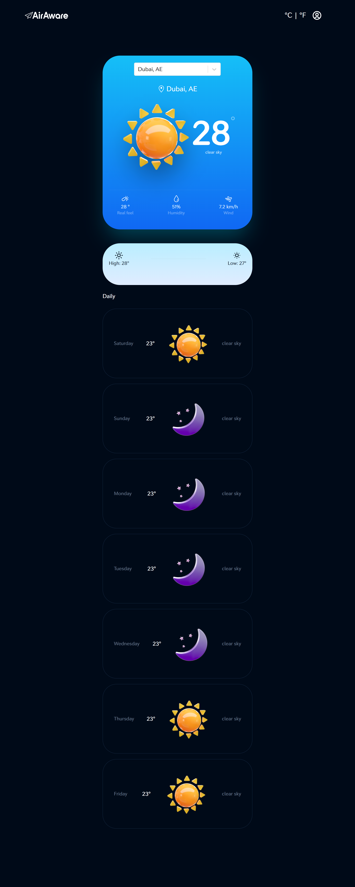

<<<<<<< HEAD
<<<<<<< HEAD
# Weather-app
=======
# React Weather App - 

<p align="center">
    
</p>




### Demo - Deployed over Github Pages 
https://airawaree.web.app/


### APIs Used
[Open Weather APIs](https://openweathermap.org/)

https://openweathermap.org/current

### API Info
* Method: `GET`
* URL: `https://api.openweathermap.org/data/2.5/weather?q={CITY_NAME}&appid={API_KEY}`


### Libraries used
* `axios`


>>>>>>> 264f27b (First Commit weatherapp)
=======

# Weather Forecast Application

A modern weather forecast web application built using React. The app provides real-time weather updates and 5-day forecasts for various cities, including features like temperature unit toggling (°C/°F), weather alerts, and responsive design.

## Features
- Displays current weather, including temperature, humidity, and wind speed.
- 5-day forecast with daily minimum and maximum temperatures.
- Weather alerts based on temperature conditions.
- Toggle between Celsius and Fahrenheit for temperature display.
- Fully responsive design for both desktop and mobile users.

## Project Structure

- **Frontend**: Built using React, with reusable components like `Navbar`, `Forecast`, `TemperatureAndDetails`, and `Inputs`.
- **API**: The app fetches weather data from the OpenWeatherMap API.

## Installation

To run this project on your local machine:

## API Configuration
This project uses two APIs: the OpenWeatherMap API for weather data and the GeoDB Cities API for city searches. Below are the details for the API keys and configuration.

GeoDB Cities API: This API is used to fetch city suggestions while the user searches for a location.

API Key: Stored in the geoApiOptions object in the src/components/Api.js file.

OpenWeatherMap API: Used to fetch weather data including current weather and forecast.

API Key: Stored in the WEATHER_API_KEY variable in the src/components/Api.js file.
 

### 1. Clone the Repository:
```bash
git clone <YOUR_REPOSITORY_URL>
cd <your_project_directory>
npm install
npm start

>>>>>>> dd9f810d61ed6c6457ffceaae10d98740553268a
